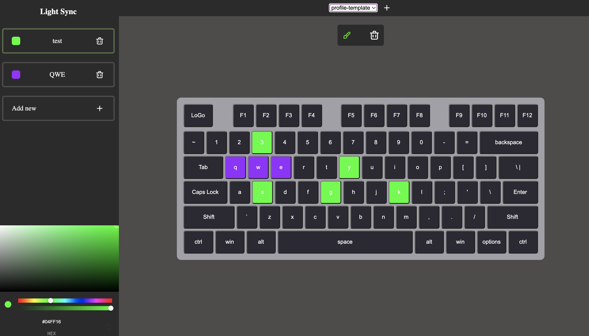

## React keyboard

One of keyboard example implementation and manipulation with that.

Build with React and redux.

### What does? 

- Remove a button from group
- Delete the group and its buttons
- Add new group
- Change name of group
- Change the color of a group of buttons
- Create new profile which contain new keyboard layer and groups
